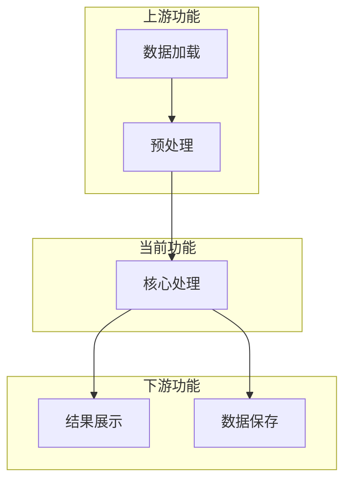
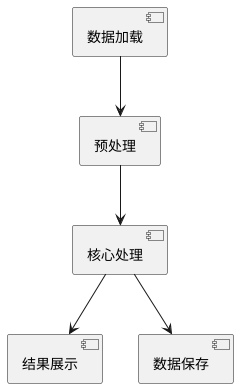
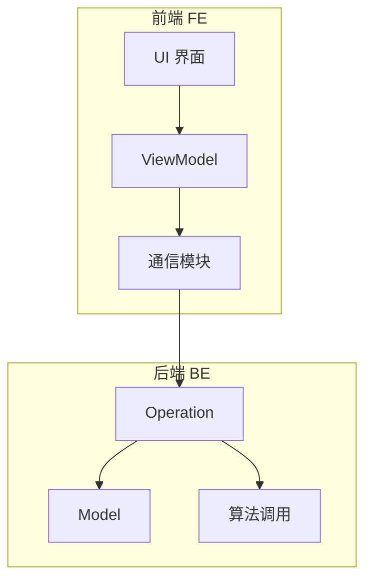
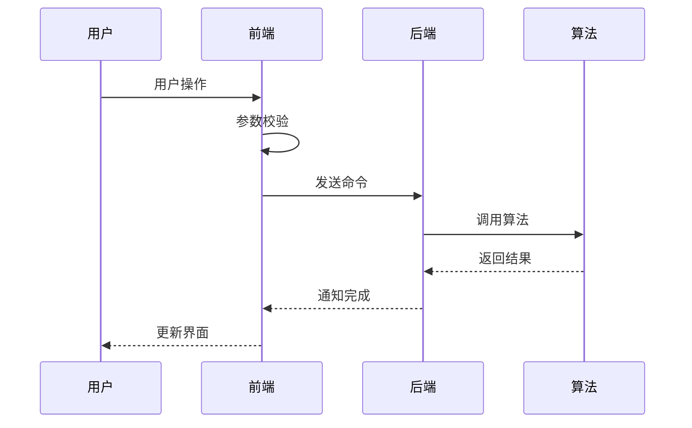
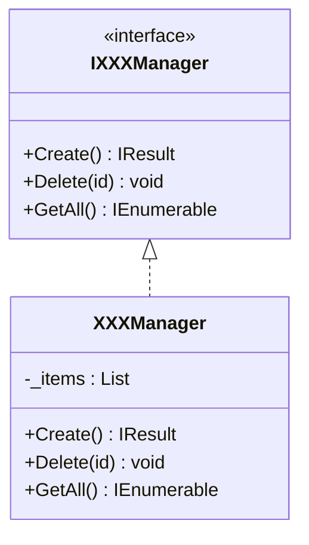
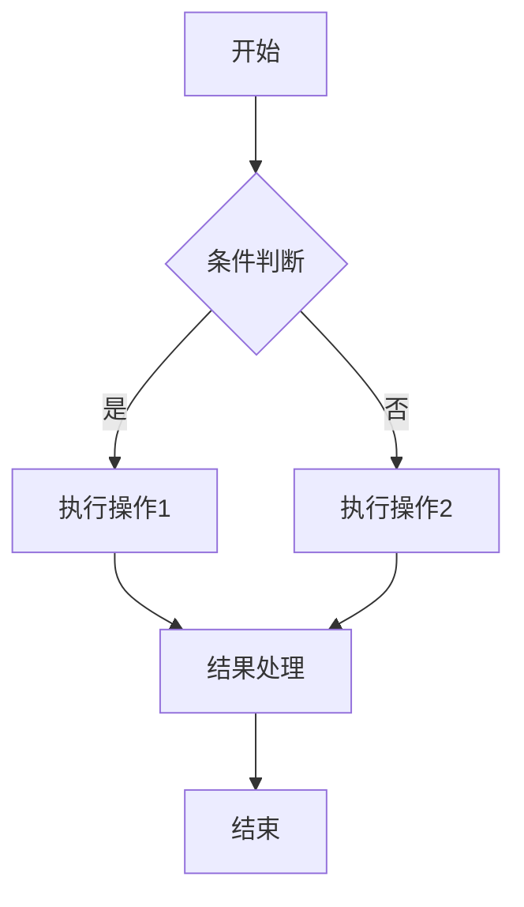

# PBI 需求返讲与设计评审文档模板

> 📚 **使用方式**: 使用 `#pbi-reviewer` 并提供 PBI 内容，AI 会自动填充此模板
> 
> ⚠️ **注意**: 生成前请确认 UML 图格式设置（mermaid 或 plantUML）

---

## 文档信息

| 属性 | 内容 |
|------|------|
| **PBI 编号** | PBI-XXXX |
| **PBI 标题** | [填写标题] |
| **产品经理** | [PM 姓名] |
| **研发负责人** | [研发姓名] |
| **编写日期** | YYYY-MM-DD |
| **版本** | v1.0 |

---

# 第一部分：需求返讲

## 1. 背景和意义

### 1.1 客户使用场景

- 客户痛点：[描述客户当前面临的问题]
- 核心诉求：[客户希望达到的目标]
- 友商实现：[竞品如何实现类似功能]

### 1.2 是否存在类似功能

- [ ] 当前应用中是否有类似功能？
- [ ] 兄弟应用中是否有类似功能？
- 如有，说明区别：[填写区别说明]

### 1.3 兄弟应用分析（如适用）

| 应用 | 是否需要 | 原因 |
|------|----------|------|
| [应用A] | [是/否] | [原因说明] |
| Fusion | [是/否] | [原因说明] |

---

## 2. 关联功能

### 2.1 现有功能交叉

> ⚠️ **强制检查**: 必须分析与历史 PBI 和现有功能的交叉

| 功能模块 | 交叉程度 | 影响说明 |
|----------|----------|----------|
| [模块1] | 高/中/低 | [具体影响] |
| [模块2] | 高/中/低 | [具体影响] |

### 2.2 关联 PBI

> 📌 **MCP 要求**: 通过 MCP 工具搜索历史 PBI

| PBI 编号 | 标题 | 关联性 | 影响范围 |
|----------|------|--------|----------|
| PBI-XXXX | [标题] | [关联说明] | [改动/兼容] |

### 2.3 功能依赖图

<!-- 
根据用户设置选择 mermaid 或 plantUML 格式
如果用户配置了 uml_format: "mermaid"，使用以下格式:
-->



<!-- 
如果用户配置了 uml_format: "plantuml"，使用以下格式:


-->

---

## 3. 需求拆解

### 3.1 工作流位置

- [ ] 上流（进应用触发）
- [ ] 中流（用户操作触发）
- [ ] 下流（结果输出阶段）

### 3.2 功能点拆解

#### 3.2.1 功能点1: [功能名称]

**需求理解**:
- [详细描述需求]

**交互设计**:
- [UI 交互说明]
- [用户操作流程]

**验收标准 (AC)**:
- [ ] [验收条件1]
- [ ] [验收条件2]
- [ ] [验收条件3]

**技术要点**:
- 输入：[输入数据]
- 输出：[输出结果]
- 约束：[限制条件]

#### 3.2.2 功能点2: [功能名称]

**需求理解**:
- [详细描述需求]

**交互设计**:
- [UI 交互说明]

**验收标准 (AC)**:
- [ ] [验收条件1]
- [ ] [验收条件2]

#### 3.2.3 待确认项（TBD）

| 序号 | 问题描述 | 相关方 | 状态 |
|------|----------|--------|------|
| 1 | [问题描述] | [PM/UX/研发] | 待确认 |

---

## 4. 工作量评估

### 4.1 工作量明细

| 工作项 | 人天 | 责任人 | 备注 |
|--------|------|--------|------|
| 需求理解/设计评审 | 2 | [姓名] | - |
| [模块1] 开发 | X | [姓名] | [备注] |
| [模块2] 开发 | X | [姓名] | [备注] |
| 联调测试 | X | [姓名] | - |
| **合计** | **X** | - | - |

### 4.2 依赖项

| 依赖类型 | 依赖内容 | 提供方 | 预计时间 |
|----------|----------|--------|----------|
| 算法 | [算法名称] | 算法组 | YYYY-MM-DD |
| 设计稿 | [CDIC稿] | UX | YYYY-MM-DD |

---

## 5. 风险分析

| 风险点 | 影响程度 | 缓解措施 |
|--------|----------|----------|
| [风险1] | 高/中/低 | [措施] |
| [风险2] | 高/中/低 | [措施] |

---

## 6. 疑问和讨论结果

| 序号 | 问题 | 结论 | 确认人 |
|------|------|------|--------|
| 1 | [问题描述] | [结论说明] | [姓名] |
| 2 | [问题描述] | [结论说明] | [姓名] |

---

# 第二部分：设计评审

## 1. 概要设计

### 1.1 架构图

<!-- 使用 mermaid 或 plantUML 绘制架构图 -->



### 1.2 模块职责

| 模块 | 层级 | 职责 |
|------|------|------|
| [模块1] | FE | [职责说明] |
| [模块2] | BE | [职责说明] |

### 1.3 文件结构

**前端 (FE)**:
```
src/{{PLATFORM_NAMESPACE}}.XXX/
├── ViewModels/
│   └── XXXViewModel.cs
├── Views/
│   └── XXXControl.xaml
└── Helpers/
    └── XXXHelper.cs
```

**后端 (BE)**:
```
src/{{PLATFORM_NS_PREFIX}}XXX/
├── Operations/
│   └── {{APP_PREFIX}}OperationXXX.h/cpp
├── Models/
│   └── XXXModel.h/cpp
└── Utils/
    └── XXXUtils.h/cpp
```

---

## 2. 详细设计

### 2.1 时序图

<!-- 使用 mermaid 绘制时序图 -->



### 2.2 核心类设计

<!-- 使用 mermaid 类图 -->



### 2.3 接口设计

#### 前端接口

```csharp
public interface IXXXService
{
    /// <summary>
    /// 执行操作
    /// </summary>
    /// <param name="param">参数说明</param>
    /// <returns>结果说明</returns>
    Task<Result> ExecuteAsync(XXXParam param);
}
```

#### 后端接口

```cpp
/// @brief 操作说明
/// @param params 参数说明
/// @return 返回值说明
int Execute(const std::string& params);
```

### 2.4 数据结构

**新增数据结构**:

```csharp
public class XXXData
{
    public string Id { get; set; }
    public XXXType Type { get; set; }
    public List<Point3D> Points { get; set; }
}

public enum XXXType
{
    Type1 = 0,  // 类型1说明
    Type2 = 1,  // 类型2说明
}
```

**Proto 协议变更**:

```protobuf
message MsgXXXInfo {
    required string id = 1;
    required int32 type = 2;
    repeated Point3D points = 3;
}
```

### 2.5 关键流程

#### 流程1: [流程名称]



---

## 3. 可能存在的问题

### 3.1 技术风险

| 风险 | 描述 | 缓解措施 |
|------|------|----------|
| 性能 | [性能风险描述] | [措施] |
| 兼容性 | [兼容性风险描述] | [措施] |

### 3.2 UX 风险

- [UX 相关风险点]

### 3.3 兼容性

- 历史数据兼容：[是否影响]
- 书签兼容：[是否影响]
- 其他应用兼容：[是否影响]

---

## 4. 自测与测试范围

### 4.1 自测范围

| 测试项 | 测试内容 | 预期结果 |
|--------|----------|----------|
| 基本功能 | [测试描述] | [预期] |
| 边界情况 | [测试描述] | [预期] |
| 异常处理 | [测试描述] | [预期] |

### 4.2 测试提醒

1. [需要重点测试的场景1]
2. [需要重点测试的场景2]
3. [特殊数据测试要求]

---

## 5. 评审结论

### 5.1 评审记录

| 评审日期 | 评审意见 | 状态 |
|----------|----------|------|
| YYYY-MM-DD | [意见记录] | 通过/待修改 |

### 5.2 遗留问题

| 问题 | 负责人 | 计划完成时间 |
|------|--------|--------------|
| [问题描述] | [姓名] | YYYY-MM-DD |

---

## 附录

### A. 参考资料

- [设计文档链接]
- [相关 PBI 链接]

### B. 修订历史

| 版本 | 日期 | 修订人 | 修订内容 |
|------|------|--------|----------|
| v1.0 | YYYY-MM-DD | [姓名] | 初始版本 |
