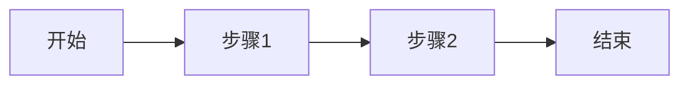

# 需求返讲文档模板

> 此文件包含标准返讲文档模板，由 SKILL.md 通过 @reference 引用

---

## 完整模板

```markdown
# [PBI编号] 需求返讲

## 1. 需求概述

### 1.1 基本信息

| 属性 | 值 |
|------|-----|
| PBI编号 | [填写] |
| 需求标题 | [填写] |
| 所属迭代 | [填写] |
| 优先级 | [填写] |
| 预估工作量 | [填写] |

### 1.2 业务背景

[描述需求的业务背景和用户痛点]

### 1.3 功能点列表

| 序号 | 功能点 | 描述 | 优先级 |
|------|--------|------|--------|
| 1 | [功能点名称] | [简要描述] | P0/P1/P2 |
| 2 | ... | ... | ... |

## 2. 需求理解

### 2.1 用户故事

作为 [用户角色]，
我希望 [功能描述]，
以便 [业务价值]。

### 2.2 业务流程



### 2.3 界面交互

[如有原型图，附上链接或描述关键交互]

## 3. 影响分析

### 3.1 涉及模块

| 模块 | 影响程度 | 说明 |
|------|----------|------|
| [模块名] | 高/中/低 | [影响说明] |

### 3.2 检查清单结果

| 检查项 | 结果 | 备注 |
|--------|------|------|
| [检查项] | Y/N/待确认 | [备注] |

### 3.3 依赖关系

- 上游依赖: [列出依赖的模块/功能]
- 下游影响: [列出会影响的模块/功能]

## 4. 风险与问题

### 4.1 识别的风险

| 风险 | 等级 | 缓解措施 |
|------|------|----------|
| [风险描述] | 高/中/低 | [措施] |

### 4.2 待确认问题

| 问题 | 状态 | 负责人 |
|------|------|--------|
| [问题描述] | 待确认 | [PM/研发] |

## 5. 开发计划

### 5.1 任务拆解

| 任务 | 预估工时 | 依赖 |
|------|----------|------|
| [任务描述] | [X]h | [依赖任务] |

### 5.2 里程碑

| 里程碑 | 日期 | 交付物 |
|--------|------|--------|
| 需求返讲 | [日期] | 返讲文档 |
| 设计评审 | [日期] | 设计文档 |
| 开发完成 | [日期] | 代码提交 |
| 测试完成 | [日期] | 测试报告 |

## 6. 验收标准

### 6.1 功能验收

- [ ] [验收条件1]
- [ ] [验收条件2]

### 6.2 非功能验收

- [ ] 性能: [具体指标]
- [ ] 兼容性: [支持的模态/设备]

---

## 附录

### 相关PBI

| PBI编号 | 标题 | 关系 |
|---------|------|------|
| [编号] | [标题] | 依赖/关联/冲突 |

### 参考资料

- [设计稿链接]
- [原型链接]
- [相关文档]
```

---

## 输出示例

执行完成后的输出格式：

```markdown
📝 **正在执行: 需求返讲助手** (`#pbi-reviewer`)

✅ 已加载 Skill 指引
⭕ 当前步骤: 步骤0 - 智能解析 PBI 输入

---

📥 **步骤0: 解析 PBI 输入**

1️⃣ 识别输入类型:
   - 检测到: DevOps 链接
   - 提取 ID: 1073716

2️⃣ 获取 PBI 详情:
   🔧 调用 MCP: mcp_azuredevops_get_work_item
   ✅ 获取成功

3️⃣ PBI 基本信息:
   - 标题: PBI_Func_{{APP_NAME}}_Feature_XXX_功能优化
   - 状态: Active
   - 迭代: Sprint 42
   - 优先级: P1

✅ 步骤0 完成
⭕ 当前步骤: 步骤1 - 解析需求

---

# PBI-1073716 需求返讲

## 1. 需求概述
...
```

---

## 输出内容清单

完成需求返讲后，应输出:

1. **返讲文档** - 按上述模板填写的完整文档
2. **检查清单** - 各模块检查项的结果汇总
3. **风险清单** - 识别的风险和待确认问题
4. **遗漏建议** - 可能遗漏的功能点或场景
