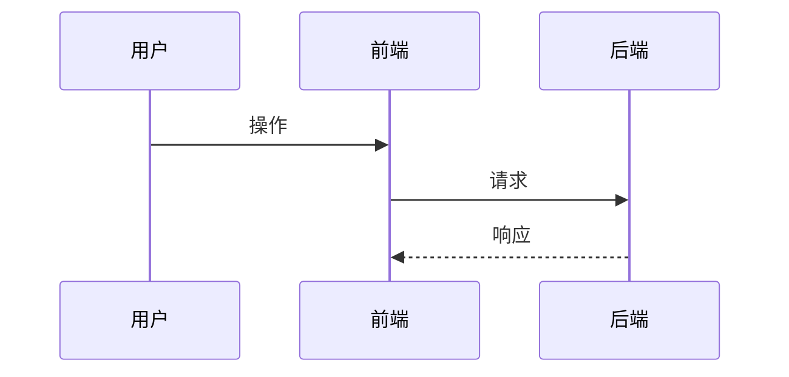
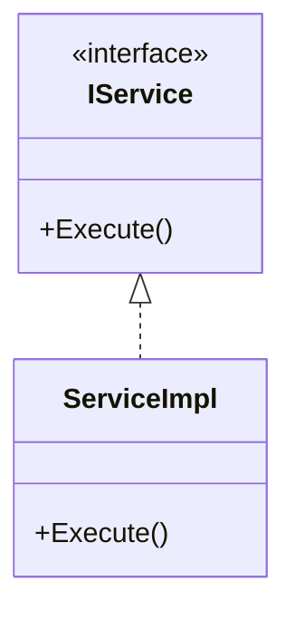
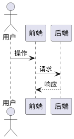
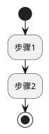
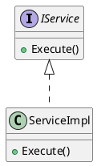

# UML 图格式配置

> 生成设计文档时，根据用户配置选择 Mermaid 或 PlantUML 语法

---

## 配置位置

`data/user_preferences.json`（相对于工作区根目录）

```json
{
  "docs_config": {
    "uml_format": "mermaid"  // 或 "plantuml"
  }
}
```

---

## 格式对照表

| 图表类型 | Mermaid | PlantUML |
|----------|---------|----------|
| 时序图 | `sequenceDiagram` | `@startuml...@enduml` |
| 类图 | `classDiagram` | `class` |
| 流程图 | `flowchart TD` | `(*) --> [*]` |
| 状态图 | `stateDiagram-v2` | `state` |

---

## Mermaid 示例

### 时序图



### 流程图


### 类图



---

## PlantUML 示例

### 时序图



### 流程图



### 类图



---

## 参考来源声明模板

执行完成时，**必须**输出以下声明：

```markdown
📚 **参考来源**:
- MCP DevOps: [成功获取 PBI-XXXXXX / 不可用]
- 历史PBI: [文件名] (X 条相关记录) / 未配置
- 检查清单: [文件路径] / 使用通用检查项
- 功能模块: [文件路径] / 未配置
- 依赖关系: [文件路径] / 未配置
- 领域专家: [调用的专家列表]
```
