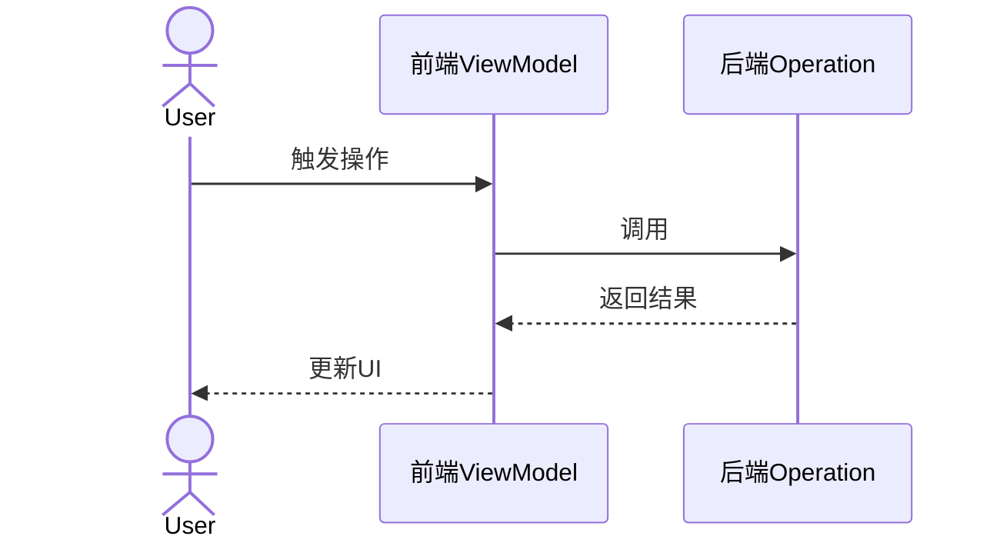
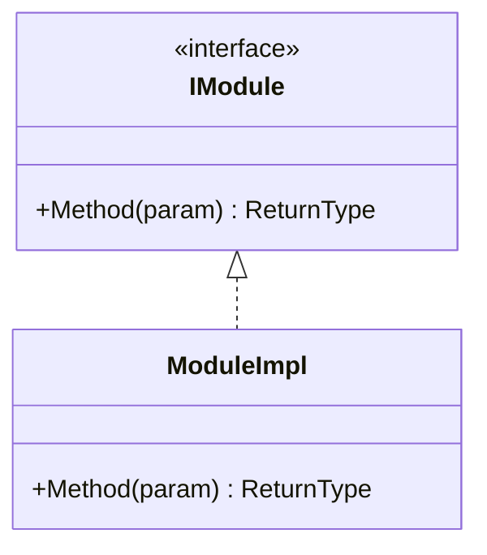

# 设计文档输出模板

本文档包含圆桌会议输出的设计文档模板，融合4个子Agent贡献，可直接用于编码。

---

## 🔴 输出原则（强制）

> ⚠️ **最终输出的设计文档必须是干净的、可直接使用的**

### 禁止包含的内容

| 禁止内容 | 原因 |
|----------|------|
| 评审结果表格（评分、改进建议） | 中间过程，不是交付物 |
| "来源: 🧠 架构派贡献" 等标注 | 角色信息，用户不关心 |
| "改进状态: ✅ 已整合" | 中间过程 |
| "文档由GitHub Copilot生成" | 不需要 |
| "经4个subAgent评审优化" | 不需要 |
| 任何“原本有问题”“已修改”等描述 | 中间过程 |

### 必须包含的内容（缺一不可）

| 必须项 | 验收标准 | 错误示例 |
|--------|----------|----------|
| Mermaid时序图 | `sequenceDiagram` 代码块 | ❌ 纯文字描述数据流 |
| Mermaid类图 | `classDiagram` 代码块 | ❌ 无类图或纯文字 |
| 接口注释 | 每个方法有 `/// <summary>` | ❌ 只有签名无注释 |
| 文件组织 | 树形目录结构 | ❌ 无文件结构 |
| 任务粒度 | 每条2-8h：`BE-1 (3h): xxx` | ❌ `Phase 1: 40h` |
| 代码骨架 | 含关键方法伪实现 | ❌ 只有接口无实现 |
### 🆕 实施派要求的完备性内容（缺一不可）

> 👨‍💻 **核心标准**：拿到这份设计，开发者能直接编码，无需额外澄清

| 必须项 | 验收标准 | 错误示例 |
|--------|----------|----------|
| **数据结构完整** | 所有Context/Result类有完整字段定义 | ❌ `ExportContext`只有名字无字段 |
| **实现骨架完整** | 核心类有方法体骨架（含步骤注释） | ❌ 只有接口定义 |
| **算法有伪代码** | 关键算法有步骤说明 | ❌ "VOI转ExportFormat"无转换步骤 |
| **调用链完整** | 从UI到数据落地的调用路径清晰 | ❌ 不知道A怎么调B |
| **BE签名完整** | C++头文件有函数声明 | ❌ 只说"后端处理" |
| **UI布局清晰** | XAML结构或布局示意 | ❌ 只说"弹窗" |

#### 数据结构定义示例

```csharp
// ✅ 正确：字段完整
public class ExportContext
{
    public string OutputPath { get; set; }
    public List<ItemData> Items { get; set; }
    public ExportFormat Format { get; set; }
    public bool CompressOutput { get; set; }
    public CancellationToken CancellationToken { get; set; }
}

// ❌ 错误：只有名字
public class ExportContext { /* 缺少字段定义 */ }
```

#### 实现骨架示例

```csharp
// ✅ 正确：有步骤骨架
public async Task<ExportResult> ExportAsync(ExportContext context, CancellationToken ct)
{
    // 1. 参数校验
    if (context.VOIs == null || !context.VOIs.Any())
        return ExportResult.Fail("VOI列表为空");
    
    // 2. 获取VOI mask数据
    var maskData = await GetMaskData(context.VOIs);
    
    // 3. 构建ExportFormat头（sform/qform）
    var niftiHeader = BuildExportFormatHeader(maskData.Dimensions, maskData.Spacing);
    
    // 4. 写入文件（含gzip压缩）
    await WriteExportFile(context.OutputPath, niftiHeader, maskData, context.CompressOutput);
    
    // 5. 返回结果
    return ExportResult.Success(context.OutputPath);
}

// ❌ 错误：空壳
public async Task<ExportResult> ExportAsync(ExportContext context, CancellationToken ct)
{
    // TODO: 实现
    throw new NotImplementedException();
}
```
---

## Plus-Design 设计文档模板 🎯

```markdown
# [功能名称] 设计文档

**PBI**: {PBI编号和标题}
**日期**: {当前日期}

---

## 1. 概述

### 1.1 功能目标
{一句话描述功能目标}

### 1.2 设计约束
- 性能要求: ...
- 兼容性要求: ...

### 1.3 关键决策
| 决策点 | 选择 | 理由 |
|--------|------|------|
| ... | ... | ... |

---

## 2. 架构设计

### 2.1 模块划分
| 模块 | 职责 | 依赖 |
|------|------|------|
| ... | ... | ... |

### 2.2 层次结构
```
┌─────────────────────────────────┐
│         表现层 (FE)              │
├─────────────────────────────────┤
│         业务层 (BE)              │
├─────────────────────────────────┤
│         数据层                   │
└─────────────────────────────────┘
```

### 2.3 数据流向
{描述数据如何在模块间流动}

### 2.4 时序图



### 2.5 类图


    ModuleImpl --> Entity
```

---

## 3. 详细设计

### 3.1 核心接口定义
```csharp
// 接口定义
public interface I{ModuleName}
{
    // 方法签名
}
```

### 3.2 关键数据结构
```csharp
public class {EntityName}
{
    // 属性
}
```

### 3.3 文件组织
```
BE/
├── src/
│   ├── {Module}/
│   │   ├── {Class}.cs
│   │   └── ...
FE/
├── ViewModels/
│   └── {ViewModel}.cs
├── Views/
│   └── {View}.xaml
```

---

## 4. 实现策略

### 4.1 开发顺序
1. **[MVP]** {最小可行功能}
2. **[核心]** {核心功能}
3. **[增强]** {增强功能}

### 4.2 复用机会
| 现有组件 | 复用方式 |
|----------|----------|
| ... | ... |

### 4.3 关键实现代码
```csharp
// 核心实现骨架
public class {ClassName}
{
    public void {MethodName}()
    {
        // TODO: 实现逻辑
    }
}
```

---

## 5. 质量保障

### 5.1 异常处理
| 异常场景 | 处理策略 | 用户提示 |
|----------|----------|----------|
| ... | ... | ... |

### 5.2 边界条件检查清单
- [ ] {边界条件1}
- [ ] {边界条件2}

### 5.3 测试用例
| 用例 | 输入 | 预期输出 | 优先级 |
|------|------|----------|--------|
| ... | ... | ... | P0 |

---

## 6. 资源与约束

### 6.1 工作量估算
| 任务 | 预估人天 | 负责 |
|------|----------|------|
| ... | ... | BE/FE |
| **总计** | **X人天** | |

### 6.2 风险与缓解
| 风险 | 概率 | 缓解措施 |
|------|------|----------|
| ... | ... | ... |

---

## 7. 开发任务拆解

- [ ] **BE-1**: {后端任务1}
- [ ] **BE-2**: {后端任务2}
- [ ] **FE-1**: {前端任务1}
- [ ] **FE-2**: {前端任务2}
- [ ] **TEST-1**: {测试任务}

---

## 8. 验收标准

- [ ] {验收标准1}
- [ ] {验收标准2}
- [ ] {验收标准3}
```
