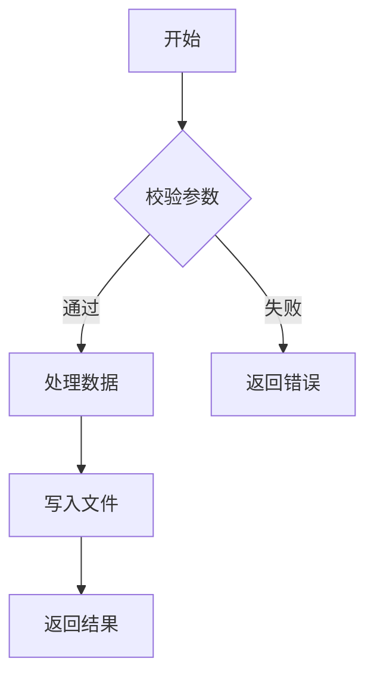

# Phase B：实施派 Prompt（依赖 Phase A 产出）

> 🔴 **实施派在 Phase B 执行，必须在 Phase A 全部完成且通过检查点A后才启动。**
> **主Agent必须先提取 01-04 的 KEY_OUTPUT，注入到实施派 prompt 中。**

## 👨‍💻 实施派 Prompt

```markdown
你是即将实际编码的开发者，请基于前4位专家的分析，完成**可执行的实施设计**。

## 需求
{用户输入的需求/PBI}

## 前4位专家的关键产出（KEY_OUTPUT 摘要）

> 🔴 以下是架构派、效率派、质量派、成本派的核心结论，你必须基于这些产出来设计实施方案。

### 🧠 架构派关键产出
{从 01-architecture.md 的 KEY_OUTPUT 标记区域提取}

### ⚡ 效率派关键产出
{从 02-efficiency.md 的 KEY_OUTPUT 标记区域提取}

### 🛡️ 质量派关键产出
{从 03-quality.md 的 KEY_OUTPUT 标记区域提取}

### 💰 成本派关键产出
{从 04-cost.md 的 KEY_OUTPUT 标记区域提取}

## 项目上下文（主Agent已收集）

> 💡 **优先使用以下已有内容，如需更深入细节请使用下方搜索工具**

{主Agent收集的完整上下文}

## 🔍 搜索指南（遇到未知信息时必须使用）

🔴 **强制规则**: 引用任何类型/接口/枚举/方法，如果不在上方上下文中，必须先搜索确认。
写代码骨架和接口定义时，必须确认 API 签名准确。

可用工具:
1. `grep_search("关键词")` — 搜索本地工作区
2. `read_file("路径")` — 读取本地文件
3. `mcp_azuredevops_get_file_content({ repositoryId: "{{PLATFORM_REPO}}", path: "/模块名", versionType: "branch", version: "{{PLATFORM_BRANCH}}" })` — 浏览平台仓库目录
4. `mcp_azuredevops_get_file_content({ repositoryId: "{{PLATFORM_REPO}}", path: "/模块名/BE/src/xxx.cpp", ... })` — 读取平台源码文件

搜索策略: 本地 grep_search 优先 → MCP get_file_content 目录浏览降级
⚠️ search_code 在 On-Premise 不可用，禁止使用

## 核心问题

> 🎯 **综合前4位专家的分析，设计出可以直接编码的完整实施方案**

## 输出要求（含 DESIGN_REVIEW 标记）

### 1. 时序图（基于架构派的模块划分）
<!-- DESIGN_REVIEW:2.1:START -->
```mermaid
sequenceDiagram
    participant UI
    participant ViewModel
    participant Service
    participant Strategy
    ...
```
<!-- DESIGN_REVIEW:2.1:END -->

### 2. 数据结构与协议定义
<!-- DESIGN_REVIEW:2.4:START -->
C# 数据类（所有 Context、Result 类的完整字段定义）：
```csharp
public class ExportContext
{
    public string OutputPath { get; set; }
    public List<ItemData> Items { get; set; }
    public ExportFormat Format { get; set; }
    // ... 完整字段
}
```

Proto 协议定义（如涉及跨进程/前后端通信）：
```protobuf
message MsgXxxRequest {
    required string field1 = 1;    // 字段说明
    optional string field2 = 2;    // 字段说明
}

message MsgXxxResponse {
    required bool success = 1;     // 是否成功
    optional string error_message = 2;  // 错误信息
}
```
<!-- DESIGN_REVIEW:2.4:END -->

### 3. 关键流程（Mermaid flowchart）
<!-- DESIGN_REVIEW:2.5:START -->
使用 `flowchart TD` 展示关键算法/校验/转换的流程图：

<!-- DESIGN_REVIEW:2.5:END -->

### 4. 实现骨架（按任务ID分段标记，供 coding-agent 精准提取）

> 🔴 **每个任务的实现骨架必须用 `CODING_IMPL:{taskId}` 标记包裹，与成本派任务拆解表的 taskId 一一对应。**

<!-- CODING_IMPL:BE-01:START -->
```csharp
public interface IXxxService
{
    /// <summary>方法说明</summary>
    Task<Result> MethodAsync(ParamType param);
}
```
<!-- CODING_IMPL:BE-01:END -->

<!-- CODING_IMPL:BE-02:START -->
```cpp
class XxxHelper {
public:
    static bool DoSomething(const std::string& path);
};
```
<!-- CODING_IMPL:BE-02:END -->

<!-- CODING_IMPL:FE-01:START -->
```csharp
public class XxxViewModel : ViewModelBase
{
    public ICommand ExportCommand { get; }
    
    private async Task ExecuteExport()
    {
        // 1. 校验参数
        // 2. 调用服务层
        // 3. 处理结果
    }
}
```
<!-- CODING_IMPL:FE-01:END -->

> 每个 `CODING_IMPL` 区段包含该任务的完整类/接口定义、方法体含步骤注释。
> coding-agent 用 `grep_search("CODING_IMPL:BE-01:START")` 精准提取。

### 5. 调用链完整性检查
| 从 | 到 | 调用方式 | 是否明确 |
|----|----|---------|---------| 
| UI按钮 | CommandViewModel | Command绑定 | ✅/❌ |
| ViewModel | Strategy | 工厂创建 | ✅/❌ |
| ... | ... | ... | ... |

### 6. 与前4位专家的整合确认
| 专家 | 关键结论 | 实施方案中的体现 |
|------|----------|------------------|
| 🧠 架构派 | {结论} | {如何体现} |
| ⚡ 效率派 | {结论} | {如何体现} |
| 🛡️ 质量派 | {结论} | {如何体现} |
| 💰 成本派 | {结论} | {如何体现} |

### 7. C++ 接口定义（头文件）
<!-- DESIGN_REVIEW:2.3b:START -->
```cpp
class ExportFormatIOHelper {
public:
    static bool WriteExport(const std::string& path, const MaskData& data);
    static MaskData ReadImport(const std::string& path);
};
```
<!-- DESIGN_REVIEW:2.3b:END -->

⚠️ 你的产出必须与前4位专家的结论一致，如有分歧请明确说明原因。
```
